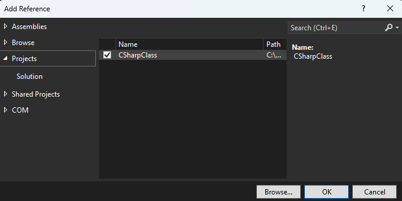
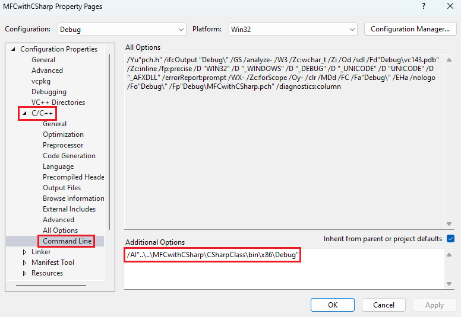

# Example of Using C# Library in MFC/C++ Project via C++/CLI

This article serves as an reference to using your .NET C# library in a native C++ project via C++/CLI. It is initially written to answer a question on CodeProject's QnA. Your C++ project does not have to be MFC in order to follow the steps described here; it can be console or other types where you can ignore step 7 to add buttons to MFC dialog because it does not apply to your C++ project type. **Note:** This example does not cover hosting C# UI element in C++ UI; That is a complex topic on its own.

**Note:** The code does not build out of the box: you have to follow step 6 to amend the absolute C# dll path given to the `/AI` switch

For simplicity, we are going to use this simple C# class with `Add` and `AddList` methods in our C++ project.

```csharp
using System;

namespace CSharp
{
    public class CSharpMath
    {
        public int Add(int a, int b)
        {
            return a + b;
        }

        public int AddList(List<int> arr)
        {
            int sum = 0;
            foreach(int n in arr)
                sum += n;

            return sum;
        }
    }
}
```

**Step 1:** Opens the MFC project's properties by the right-clicking the project in the solution explorer and select "Properties".


**Step 2:** The Properties Pages dialog shows up. Enable the .NET CLR. The .NET Framework version has to be the same as your C# library.


**Step 3:** Add the reference to the C# library in the MFC project by right-clicking on the Reference node and select "Add Reference..."


Check on the C# project which you want to add reference.



**Step 4:** Next, we'll add a build dependency on the C# project so that whenever MFC/C++ is built, Visual Studio will build the C# project first.


Check the C# project for the build dependency.


**Step 5:** Opens the MFC project's properties by the right-clicking the project in the solution explorer and select "Properties". Click on the "Configuration Manager...". Make sure all the platform is the same. The C# project cannot be AnyCPU configuration: it has to be either x86 or x64, matching what the C++ project setting. If x86 or x64 does not exist, then you have to create them from AnyCPU settings.


**Step 6:** Close the Configuration Manager after all the platform. Next, we add the `/AI` switch to the C++ compiler. `/AI` switch tells the C++ compiler where to find your C# dll. Do not use my path here because it will be certainly different from yours. You have to enter 4 different paths for Debug x86, Debug x64, Release x86 and Release x64.



**Step 7:** The last step is to add 2 buttona called "Add" and "Add List" to the MFC project. Double click the buttons in the UI designer and a empty button handler will be created for you to call your C# `Add` and `AddList` methods.


**Step 8:** In the cpp where you're going to use your C# class, add the `using` keyword to import your C# dll. Amend the dll name according to yours.

```Cpp
#using "CSharpClass.dll"
```

In our first button handler, add these code to call the C# class's `Add()`. Make sure the C# class type ends with a hat(^) and use `gcnew` to instantiate your C# class (Do not use `new` keyword because it is reserved for instantiating native C++ objects on the heap). It shows the addition result in a message box.

```Cpp
void CMFCwithCSharpDlg::OnBnClickedBtnAdd()
{
    CSharp::CSharpMath^ mathClass = gcnew CSharp::CSharpMath();
    int result = mathClass->Add(2, 6);

    char buf[200];
    sprintf_s(buf, "Add result: %d", result);
    MessageBoxA(GetSafeHwnd(), buf, "Add", MB_OK);
}
```

You can use .NET Base Class Library (BCL) such as `List` class. Replace the dots with `::` in the namespace. Remember to add another button to the MFC dialog to call `AddList()` and add the code below to the function.

```Cpp
void CMFCwithCSharpDlg::OnBnClickedBtnAddList()
{
	CSharp::CSharpMath^ mathClass = gcnew CSharp::CSharpMath();

	System::Collections::Generic::List<int>^ myList = gcnew System::Collections::Generic::List<int>();

	myList->Add(1);
	myList->Add(2);
	myList->Add(3);

	int result = mathClass->AddList(myList);

	char buf[200];
	sprintf_s(buf, "Add List result: %d", result);
	MessageBoxA(GetSafeHwnd(), buf, "Add List", MB_OK);
}
```

Build your C++ project and the C# project automatically builds first because of the build dependency set in step 4. Click the "Add" or "Add List" button. Make sure it does not crash and the result is correct.

That's all for the example. Hopefully you can use your C# library in your C++ project. Next step is to master C++/CLI.
